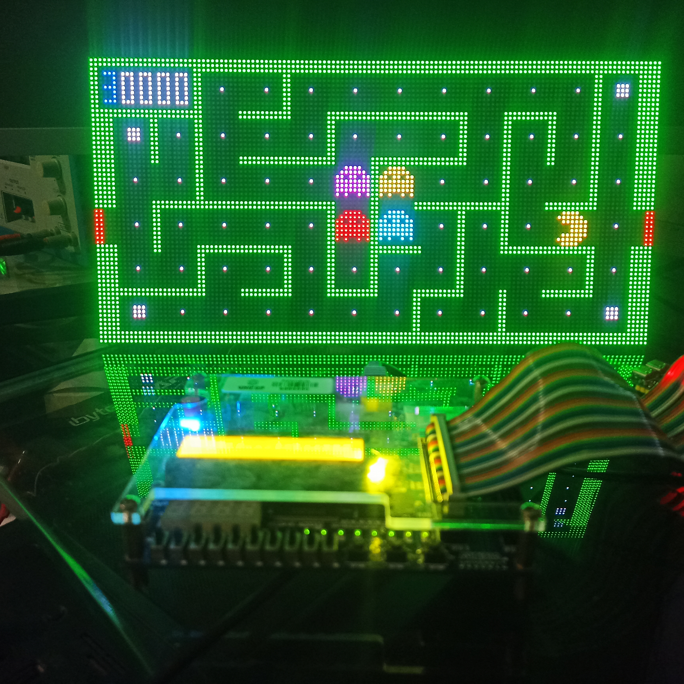

# MEU_CONSOLE_FPGA_DE0_SD

FPGA game console based on **Nios II**, with a **launcher stored in NOR flash**, games loaded from an **SD card**, **PS/2 keyboard** input, and controller support through **UART/Bluetooth**.

Versao em portugues: [README.md](./README.md)

The project targets the **Intel/Altera Cyclone III** family and uses **Quartus II 13.0 SP1** plus **Nios II EDS 13.0 SP1**. The hardware integrates a Nios II CPU, SDRAM, PS/2 interface, UART, SD card SPI, parallel flash controller, and LED matrix output.

## Overview

When the board powers up:

1. the FPGA configures the hardware
2. Nios II starts a small bootloader from on-chip memory
3. the bootloader reads the `launcher` image stored in NOR flash
4. the `launcher` starts from SDRAM
5. the `launcher` mounts the FAT32 SD card
6. `.gmod` game files are listed in the menu
7. the selected game is loaded into SDRAM and executed

## Main Features

- Autonomous boot flow without depending on `nios2-download`
- `launcher` persisted in parallel flash
- Games stored on the SD card as `.gmod` files
- Navigation with **PS/2 keyboard**
- Alternative control through **UART** for serial/Bluetooth controllers
- **HUB75 LED matrix** rendering
- **SDRAM** used for launcher and game execution
- Tooling to update launcher, bootloader, and games independently

## Photos

Pac-Man running on the LED matrix with the board in the foreground:



Launcher screen showing SD games while using a Bluetooth controller through UART:


## Hardware

The main hardware lives in [`hardware/`](./hardware) and uses [`hardware/Hardware.vhd`](./hardware/Hardware.vhd) as the top-level file.

Relevant blocks currently present:

- **Nios II Qsys** system generated in `hardware/NiosII_ps2/`
- **PS/2** through `ps2_avalon_interface.vhd`
- **UART** for serial/Bluetooth command input
- **SD card SPI** for game loading
- **Parallel NOR flash** for launcher storage
- **SDRAM** as main execution memory
- **LED matrix** driven by `led_matrix_avalon.vhd`
- **Audio I2C** already integrated in hardware

Quartus project files:

- project file: [`hardware/DriverVHDL.qpf`](./hardware/DriverVHDL.qpf)
- constraints and pin mapping: [`hardware/DriverVHDL.qsf`](./hardware/DriverVHDL.qsf)

## Software Architecture

The software is organized into three main layers:

- **flashboot**
  Minimal bootloader executed from on-chip memory. It loads the launcher from NOR into SDRAM.
- **flashwrite**
  Utility application used to write or update the launcher image in parallel flash.
- **launcher**
  Main menu that mounts FAT32 on the SD card, lists games, and loads `.gmod` files.

Main folders:

- [`software/bsp/`](./software/bsp): Nios II EDS generated BSP
- [`software/games/flashboot/`](./software/games/flashboot): bootloader
- [`software/games/flashwrite/`](./software/games/flashwrite): launcher image flashing to NOR
- [`software/games/launcher/`](./software/games/launcher): launcher and game modules
- [`software/scripts/`](./software/scripts): build and programming helper scripts
- [`software/workspace/`](./software/workspace): Nios app/workspace used in the development flow

## Boot Flow

Validated project flow:

1. Nios II leaves reset in on-chip memory
2. `flashboot` starts
3. NOR flash is stabilized and forced into `read array`
4. the launcher `LNCH` header is validated
5. the launcher payload is copied into SDRAM
6. `gp`, `sp`, and `entry` are adjusted
7. execution is transferred to the launcher
8. the launcher mounts FAT32 and lists available games

Supporting docs:

- [`software/games/flashboot/BOOT_FLOW.md`](./software/games/flashboot/BOOT_FLOW.md)
- [`software/games/flashboot/README.md`](./software/games/flashboot/README.md)
- [`software/games/flashwrite/README.md`](./software/games/flashwrite/README.md)

## Game Format

Games on the SD card are stored as binary `.gmod` files.

Current format characteristics:

- multiple loadable segments
- `entry_addr`, `stack_addr`, and `gp_addr` in the header
- direct SDRAM loading by the launcher

Definitions:

- [`software/games/launcher/app/launcher_image.h`](./software/games/launcher/app/launcher_image.h)
- generator script: [`software/scripts/gerar_gmod.ps1`](./software/scripts/gerar_gmod.ps1)

Games currently present in the repository:

- Arkanoid
- Boulder Dash (`gdash`)
- Pac-Man
- Pong
- River Raid
- Snake
- Space Invaders
- Tetris

Ready-made example binaries are available in:

- [`software/games/launcher/app/gmods/`](./software/games/launcher/app/gmods)

## Controls

The launcher accepts input from:

- **PS/2**
- **UART**
- local buttons mapped through PIO

In the launcher, the main mapping is:

- `Up/Down`: navigate menu
- `L`, `Enter`, `Space`, or equivalent serial input: select/load

Game code currently combines:

- **PS/2** scan code handling
- **UART** byte-based input

This allows a PS/2 keyboard or a Bluetooth controller that outputs serial commands to the system UART.

## Build

### Requirements

- Quartus II **13.0 SP1**
- Nios II EDS **13.0 SP1**
- Windows with access to `Nios_Shell.bat`
- **USB-Blaster** cable

Current script paths assume:

- `F:\altera\13.0sp1\quartus`
- `F:\altera\13.0sp1\nios2eds`

If your installation uses different paths, update the `.bat` and `.ps1` files in [`software/scripts/`](./software/scripts) and the VS Code settings in [`.vscode/settings.json`](./.vscode/settings.json).

### Hardware

Generate Qsys:

```powershell
cd software\scripts
.\Generate_Qsys.bat
```

Compile in Quartus:

```powershell
cd hardware
quartus_sh --flow compile DriverVHDL
```

Program the FPGA:

```powershell
cd hardware\output_files
quartus_pgm -m jtag -c USB-Blaster -o "p;DriverVHDL.sof"
```

### BSP

Regenerate BSP files:

```powershell
cd software\bsp
nios2-bsp-generate-files --settings=settings.bsp --bsp-dir=.
```

Build BSP:

```powershell
cd software\scripts
.\compila_BSP.bat
```

### Launcher

Build and download the launcher for development:

```powershell
cd software\games\launcher\app
.\compila_grava.bat
```

### Generate The Launcher Flash Image

```powershell
powershell -ExecutionPolicy Bypass -File software\scripts\gerar_launcher_flash_image.ps1
```

This script generates:

- `software/games/launcher/app/launcher_flash.img`
- `software/games/flashwrite/app/launcher_flash_payload.h`

### Write The Launcher To NOR

After generating the image:

1. build `flashwrite`
2. run `flashwrite` on the board
3. it erases, writes, and verifies the image in flash

Documentation:

- [`software/games/flashwrite/README.md`](./software/games/flashwrite/README.md)

### Update The On-Chip Bootloader

Whenever `flashboot` changes:

1. build `software/games/flashboot/app`
2. generate `hardware/onchip_mem.hex`
3. recompile the Quartus hardware so the new HEX is embedded into the bitstream

Detailed flow:

- [`software/games/flashboot/BOOT_FLOW.md`](./software/games/flashboot/BOOT_FLOW.md)

## Generating A New `.gmod` Game

Each external game has its own module under:

- `software/games/launcher/app/<name>_module/`

Each module usually contains:

- `main.c`
- `external_main.c`
- `build_external.bat`

Example build:

```powershell
cd software\games\launcher\app\pacman_module
.\build_external.bat
```

The resulting `.gmod` is written to:

- [`software/games/launcher/app/gmods/`](./software/games/launcher/app/gmods)

Documentation:

- [`software/games/launcher/EXTERNAL_BUILD.md`](./software/games/launcher/EXTERNAL_BUILD.md)

## Repository Layout

```text
MEU_CONSOLE_FPGA_DE0_SD/
|- hardware/                      -> Quartus project and HDL components
|- software/
|  |- bsp/                        -> Nios II BSP
|  |- games/
|  |  |- flashboot/               -> on-chip bootloader
|  |  |- flashwrite/              -> launcher image flashing to NOR
|  |  |- launcher/                -> launcher and games
|  |- scripts/                    -> build, flash, and image generation automation
|  |- workspace/                  -> development app/workspace
|- .vscode/                       -> VS Code tasks and action buttons
```

## VS Code

The repository includes VS Code integration:

- action buttons in [`.vscode/settings.json`](./.vscode/settings.json)
- tasks in [`.vscode/tasks.json`](./.vscode/tasks.json)
- debug configuration in [`.vscode/launch.json`](./.vscode/launch.json)

The workflow is set up to invoke the Intel/Altera environment through `Nios_Shell.bat`.

## Current Project Status

Based on the current repository state:

- the Quartus hardware is present and buildable
- `flashboot` is integrated into the boot flow
- the `launcher` loads `.gmod` images from SD
- FAT32 reading is implemented inside the launcher
- games already have modules and `.gmod` artifacts
- PS/2 and UART control are present in both launcher and games

## Notes

- The repository includes generated Qsys/synthesis files because they are part of the current workflow.
- Heavy Quartus build artifacts and temporary Nios objects are filtered by [`.gitignore`](./.gitignore).
- Some internal documents reflect earlier development stages; this README describes the flow that matches the current codebase.

## License

This project is licensed under the [MIT License](./LICENSE).
